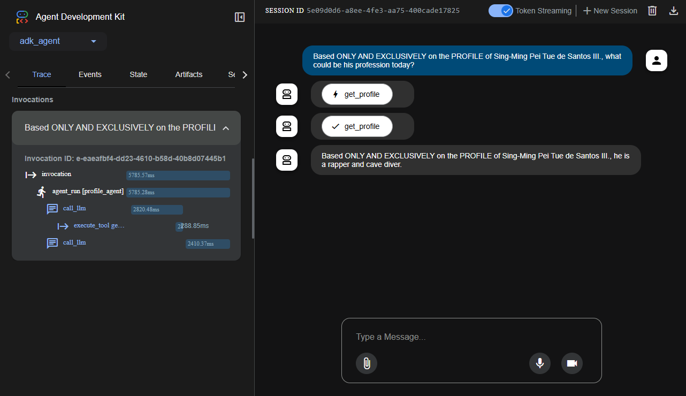

# Google Agent Development Kit (ADK) MCP Client

This project demonstrates a high-level, declarative approach to building an LLM agent using the Google Agent Development Kit (ADK). The agent is designed to consume tools from a remote MCP (Model-Context-Protocol) server.

## Core Concept

The ADK framework simplifies agent creation by allowing developers to *declare* the agent's properties and toolsets. When provided with an MCP server endpoint, the ADK's built-in `MCPToolset` automatically discovers and integrates the available tools, handling the entire orchestration loop (reasoning, tool calling, and response generation) with no manual coding required.

This represents the state-of-the-art for rapid, convention-based agent development.

## Files

- **`agent.py`**: The complete agent definition. It simply declares the `root_agent` and points it to the MCP server running at `http://localhost:8181`.

## How to Run

You will need two terminals open, both navigated to the project root directory.

### 1. Setup
This agent requires the Google Cloud SDK for authentication and the `google-adk` library. It is recommended to use the project's root virtual environment.

```bash
# Activate the virtual environment from the project root
# On Windows
.venv\Scripts\activate
# On Linux/macOS
# source .venv/bin/activate

# The ADK library should be installed from the root requirements.txt
# If not, run: pip install google-adk

# Install and initialize the Google Cloud SDK if you haven't already
# Follow instructions at: https://cloud.google.com/sdk/docs/install

# Log in for Application Default Credentials
gcloud auth application-default login
```

### 2. Start the MCP Server (Terminal 1)
This agent requires the MCP tool server to be running. In your first terminal, run the server from the `mcp` directory:
```bash
python mcp/server.py
```
The server will start and listen on port 8181.

### 3. Run the ADK Agent (Terminal 2)
In your second terminal, run the ADK agent by pointing the `adk` command to the `adk-agent` directory:
```bash
adk run adk-agent
```

When the `User:` prompt appears, enter your question. For example:
```
User: Based ONLY AND EXCLUSIVELY on the PROFILE of Sing-Ming Pei Tue de Santos III., what could be his profession today?
```

### 4. Web UI
To visualize the agent's execution, you can use the `adk web` command.

```bash
# Make sure to run in the parent (root) directory
adk web adk-agent
```
The command will print a URL (e.g., `http://127.0.0.1:8000`) that you can open in a web browser to see a real-time, interactive graph of the agent's thought process.

