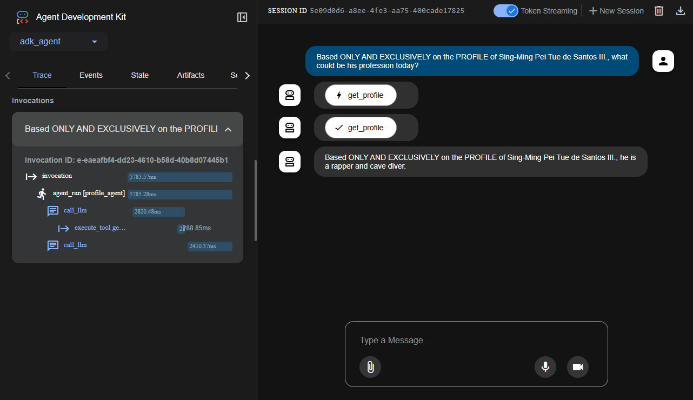

# MCP Tool Server and Multi-Framework Agent Clients

This project demonstrates how to create a tool-providing server using the Model-Context-Protocol (MCP) and build intelligent, agentic clients with various frameworks to consume those tools.

It showcases three different client implementations, progressing from manual orchestration to fully automated, framework-native solutions.

## Core Components

- **`server.py`**: An MCP server built with `FastMCP`. It exposes a single tool, `get_profile`, which provides a fictional profile for a given name.

- **`requirements.txt`**: Contains all necessary dependencies for the server and all three clients (`mcp`, `openai`, `langchain`, `google-adk`).

## Client Implementations

### 1. Low-Level Manual Client (`client.py`)
- **Purpose**: Demonstrates the fundamental steps of LLM orchestration without a high-level framework.
- **Process**: Manually defines the tool for the LLM, sends the prompt, checks if the LLM wants to call the tool, executes the MCP call, and sends the result back to the LLM for a final answer.
- **Good for**: Understanding the core mechanics of how agents use tools.

### 2. LangChain Agent Client (`mcp_client.py`)
- **Purpose**: Shows a more robust, framework-based approach using LangChain.
- **Process**: Uses a custom-built `MCPToolkit` to automatically discover tools from the server. A LangChain `AgentExecutor` then handles the entire orchestration loop.
- **Key Modules**:
    - `mcp_tool.py`: A generic wrapper to make a single MCP function compatible with LangChain.
    - `mcp_toolkit.py`: A self-contained toolkit that manages the connection and discovery process.

### 3. Google Agent Development Kit (ADK) Client (`adk_agent/`)
- **Purpose**: Demonstrates the ideal, high-level, declarative approach using a framework with built-in MCP support.
- **Process**: The `adk_agent/agent.py` file simply *declares* the agent and points to the MCP server. The ADK framework handles all discovery, orchestration, and execution.
- **Good for**: Seeing the state-of-the-art for rapid, convention-based agent development.

## How to Run

### 1. Setup
It is recommended to use a virtual environment.
```bash
# Create and activate a virtual environment
python -m venv .venv
# On Windows
.venv\Scripts\activate
# On Linux/macOS
# source .venv/bin/activate

# Install dependencies
pip install -r requirements.txt
```

### 2. Set Environment Variables
The LangChain and manual clients use OpenAI. The ADK client uses Google's Gemini.

```bash
# For OpenAI (used by client.py and mcp_client.py)
# On Windows (Command Prompt)
set OPENAI_API_KEY="your_openai_api_key"
# On Linux/macOS
# export OPENAI_API_KEY="your_openai_api_key"

# For Google ADK (used by adk_agent)
# Install the Google Cloud SDK, then run:
gcloud auth application-default login
```

### 3. Start the MCP Server
This is required for all clients. In one terminal, run:
```bash
python server.py
```

### 4. Run a Client
In a second terminal, choose one of the following clients to run.

#### Option A: Run the LangChain Client (Recommended)
```bash
python mcp_client.py
```

#### Option B: Run the Google ADK Client
The ADK uses its own command-line tool to run agents.

1.  **Run the agent interactively:**
    ```bash
    adk run adk_agent
    ```
2.  When the `User:` prompt appears, enter your question. For example:
    ```
    User: Based ONLY AND EXCLUSIVELY on the PROFILE of Sing-Ming Pei Tue de Santos III., what could be his profession today?
    ```

3.  **Follow the execution in a web browser (optional):** The `adk` tool will print a URL to a local web server (e.g., `http://127.0.0.1:8000`). You can open this URL to see a real-time, interactive graph of the agent's thought process and tool calls.

    Below is an example of the web trace, showing the LLM's reasoning, the tool call it decided to make, and the final result.

    

#### Option C: Run the Low-Level Manual Client
```bash
python client.py
```
